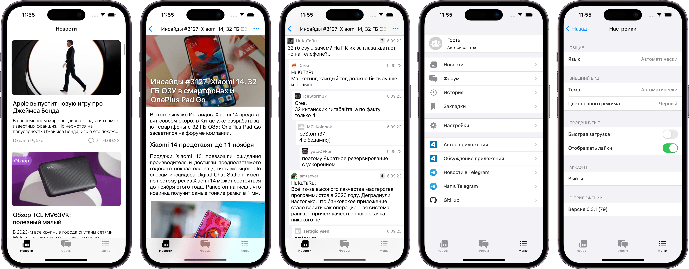

# ForPDA
  
Альтернативный клиент [4pda.to](https://4pda.to/)

## Скриншоты

## TestFlight
Актуальная ссылка на [TestFlight](https://testflight.apple.com/join/CuI3nlN2)

## Требования и установка
- iOS 15.0+ / macOS 14.0+
- Xcode 15.0+ / Swift 5.9+
- Скачать и запустить проект, зависимости загрузятся автоматически через SPM
- (Опционально) Для запуска сервисов Sentry/Mixpanel переименовать SecretsExample.xcconfig в Secrets.xcconfig и заменить все значения на свои

## Используемые библиотеки
- [Fastlane](https://github.com/fastlane/fastlane) - автоматизация сборки и выгрузки на TestFlight
- [Mixpanel](https://github.com/mixpanel/mixpanel-swift) - аналитика
- [Sentry](https://github.com/getsentry/sentry-cocoa) - мониторинг ошибок
- [SwiftSoup](https://github.com/scinfu/SwiftSoup) - парсинг HTML страниц
- [SwitchRichString](https://github.com/malcommac/SwiftRichString) - преобразование HTML в TextView
- [RouteComposer](https://github.com/ekazaev/route-composer) - навигация
- [Rswift](https://github.com/mac-cain13/R.swift) - кодогенерация текста/картинок/шрифтов/цветов
- [Factory](https://github.com/hmlongco/Factory) - инъекция зависимостей
- [Nuke](https://github.com/kean/Nuke) - загрузка и кеширование изображений
- [SnapKit](https://github.com/SnapKit/SnapKit) - для упрощения работы с констреинтами
- [SwiftMessages](https://github.com/SwiftKickMobile/SwiftMessages) - всплывающие окна
- [SwipeCellKit](https://github.com/SwipeCellKit/SwipeCellKit) - отображение комментариев
- [SwiftyGif](https://github.com/kirualex/SwiftyGif) - отображение гифок
- [YouTubePlayerKit](https://github.com/SvenTiigi/YouTubePlayerKit) - отображение видео с YouTube
- [SFSafeSymbols](https://github.com/SFSafeSymbols/SFSafeSymbols) - типобезопасные SF символы

## Благодарности
- [Tatiana](https://github.com/tikh-hehe) - за помощь с доработкой функционала

## Лицензия
GPL v3 (C) 2022-2023 [Ilia Lubianoi](https://github.com/SubvertDev)
