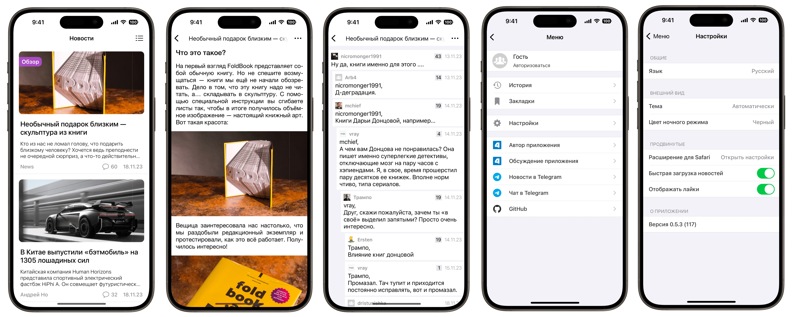

  

  
<h3>
Любительский iOS клиент <a href="https://4pda.to/">4pda.to</a>
</h3>

## Скриншоты

## Установка
- Минимальная поддерживаемая версия: iOS 16
- Актуальная ссылка на TestFlight: [Стабильная](https://testflight.apple.com/join/CuI3nlN2) / [Бета](https://testflight.apple.com/join/bE3XxjQ0)
- Также каждый релиз имеет приложенный к нему .ipa файл ([актуальная вресия](https://github.com/SubvertDev/ForPDA/releases/latest))

## Функционал
- [x] Статьи
  - [x] Комментарии
  - [ ] Ответы, лайки, жалобы
- [x] Профили (частично)
- [ ] Форум
- [ ] Избранное, закладки, история
- [ ] QMS, упоминания, уведомления

## Чаты по приложению
Обсуждение в телеграме - [тык](https://t.me/forpda_ios_chat)  
Список изменений в телеграме - [тык](https://t.me/forpda_ios)

## Дорожная карта на ближайшие версии (может меняться)
**0.7** - Взаимодействие с комментариями (ответы/лайки/жалобы)  
**0.8** - Упрощенный форум  
**0.9** - Избранное, закладки, история  
**0.10** - Упоминания, уведомления  
**0.11** - Доработка форума  
**0.12** - QMS  
**1.0** - ???

## Техническая часть
‼️ **НА ДАННЫЙ МОМЕНТ ПРОЕКТ НЕВОЗМОЖНО СОБРАТЬ ИЗ-ЗА ПРИВАТНОЙ ЗАВИСИМОСТИ** ‼️
- Swift 6 + SwiftUI 5 + Xcode 16
- Модульная архитектура с использованием [TCA](https://github.com/pointfreeco/swift-composable-architecture)
- Для запуска Mixpanel/Sentry необходимо переименовать SecretsExample в Secrets и вписать свои данные

## Благодарности
- [Xialtal](https://github.com/Xialtal) - за неоценимый вклад в развитие серверной части
- [DrozD-ios-dev](https://github.com/DrozdD-ios-dev) - за исправление багов
- [tikh-hehe](https://github.com/tikh-hehe) - за помощь с доработкой функционала

## Лицензия
GPL v3 (C) 2022-2024 [Ilia Lubianoi](https://github.com/SubvertDev)
